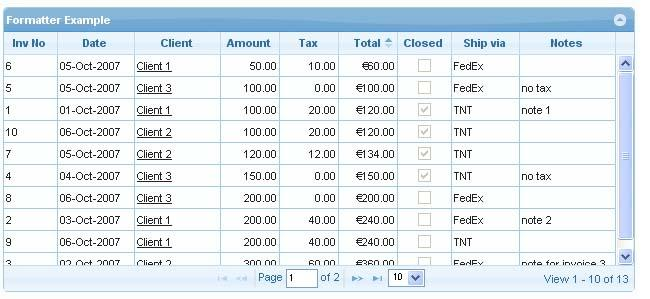
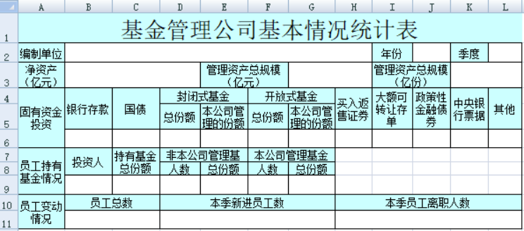

# Web 端实现类 Excel 应用的方案与产品
**集合了目前在 Web 端实现类 Excel 应用的主要实现方案及产品，其中包括流行的前端控件和前后端集成化后的整体方案，主要内容包含：**
- [Web 端实现类 Excel 应用的方案与产品](#web-端实现类-excel-应用的方案与产品)
- [前端 JavaScript 控件（库）](#前端-javascript-控件库)
- [集成方案](#集成方案)
- [选型参考](#选型参考)

### 前端 JavaScript 控件（库）
- [SpreadJS - 可嵌入您系统的在线 Excel](https://www.grapecity.com.cn/developer/spreadjs) 
- [Handsontable - JavaScript data grid with spreadsheet UI](https://handsontable.com/)
- [Jspreadsheet - JavaScript Data Grid with Advanced Spreadsheet Controls](https://jspreadsheet.com/)
- [Luckysheet(Univer) - The next-generation open-source office suite](https://univer.ai/)

### 集成方案
- [Office 365](https://www.microsoft.com/en-us/microsoft-365)
- [WPS](https://open.wps.cn/)
- [OnlyOffice](https://www.onlyoffice.com/)
- [PageOffice](https://www.zhuozhengsoft.com/PageOffice/)
- [E-ICEBLUE(Spire) ](https://www.e-iceblue.com/)
- [永中 Web Office](https://weboffice.yozosoft.com/)

### 选型参考
#### 问题：需要的是 Grid 还是 Spreadsheet？
- 在实际的表格应用中，经常有两种容易混淆的表格概念，Grid/Table vs Spreadsheet
    - Grid/Table - 表格，常见用于展示结构化的数据，例如数据库中二维表，如下图：
    
    - Spreadsheet - 电子表格，也就是我们所熟知的 Excel
    
- 主要差别
    | **功能点**  | **Grid / Table**  | **Spreadsheet(Excel)**  |
    |:--------:|:---------------:|:-----------------------:|
    | **数据单元** | 行记录 / Row based | 单元格 / Cell based |
    | **公式函数** | 不需要             | 需要                      |
    | **分页**   | 需要              | 不需要                     |
    | **分组**   | 行分组             | 行与列分组                   |
    | **形状**   | 不需要             | 需要                      |
    | **图表**   | 不需要             | 需要                      |
    | **排序**   | 需要              | 需要                      |
    | **筛选**   | 需要              | 需要                      |
#### 问题：是一个复杂的表格应用场景，还是在线办公？
- 表格应用场景：需要考虑专业的表格控件，具备更好的扩展和二次开发能力
- 在线办公：需要考虑文档级别的支持，例如常见文档格式 XLS / DOC / PPT
#### 问题：技术框架要求？
- 是否能接受后端 .NET 或者 Java 部署？
- 是否支持 Vue / React / Angular 框架？
#### 问题：客户端浏览器是否需要适配 IE 7 / 8 / 9？
- 能够适配旧版本浏览器的方案较少，而且功能受限，选择时需要注意